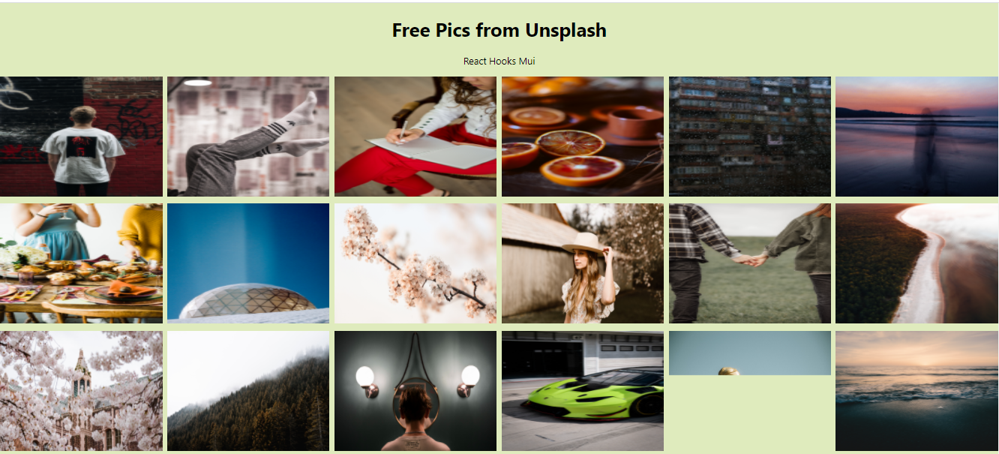

# Unsplash-React App

## Overview

This is a front end app that uses Unsplash API to make a dynamic web page that populates free images. This app has been made with Material UI framework.

## Website link

This app is hosted with netlify : https://freepicsunsplash.netlify.app/

Also I have made a youtube video for this app, link: https://www.youtube.com/watch?v=nR8noi7NT-g&t=1326s

## Screenshot



## Installation

```
Git - Installing Git: Run git from terminal

git clone https://github.com/sharmap1/Unsplash-React-Hooks.git bash

```

## Technologies used

- Unsplash API
- React.js
- Axios
- Material UI

## Contributing

- Pull requests are welcome. For major changes, please open an issue first to discuss what you would like to change.

## Copyright

Copyright (c) [2021] [Prasamsha Sharma]
